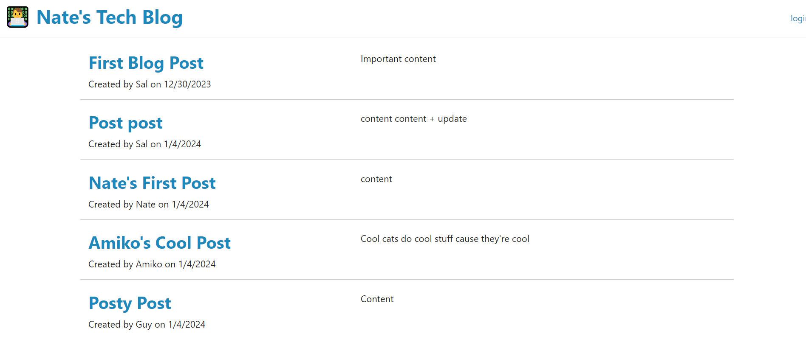

# Tech Blog

## Description
    
A technical blog which allows multiple users to write posts about technical learnings. This app allows many users to read others' blog posts and comment on them. It allows new users to sign up and blog themselves. There is also functionality built in to edit previously posted blog posts and delete unwanted posts
    
## Table of Contents (Optional)
    
- [Installation](#installation)
- [Usage](#usage)
- [Credits](#credits)
- [License](#license)
- [Badges](#badges)
- [Features](#features)
- [Contribute](#contribute)
- [Tests](#tests)
- [Questions](#questions)

    
## Installation
    
There are no installation requirements, simply navigate to the deployed URL and start blogging!
    
## Usage
    
The application is open to all to blog on
    

        
    
## Credits
    
I built this myself by referencing previously used course materials

## Contribute
    
If you created an application or package and would like other developers to contribute it, you can include guidelines for how to do so. The [Contributor Covenant](https://www.contributor-covenant.org/) is an industry standard, but you can always write your own if you'd prefer.
    
## Tests
    
The application was tested locally using a locally hosted node JS server

## Questions

If you have any questions, feel free to reach out to me at nate.mcmahon47@gmail.com or reference my GitHub:
[github.com/natemcmahon](github.com/natemcmahon)